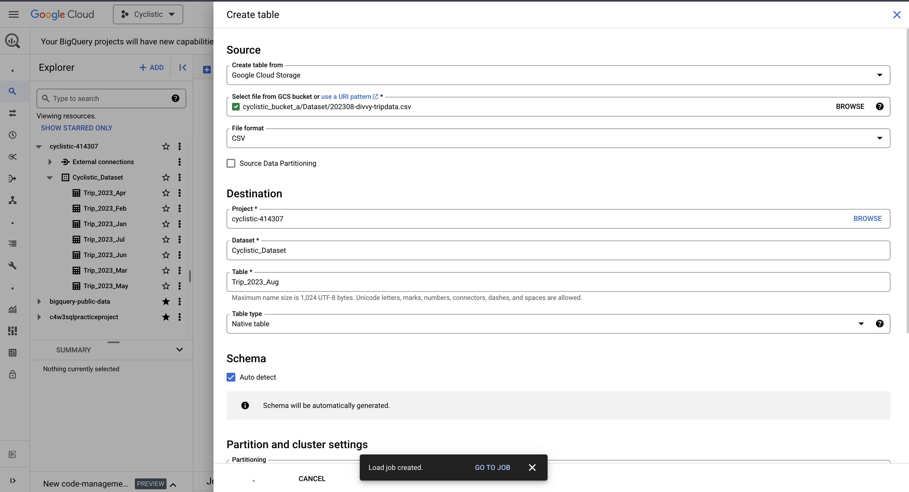
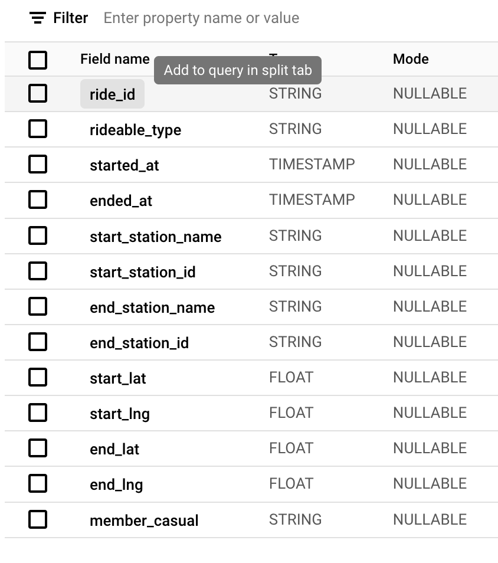
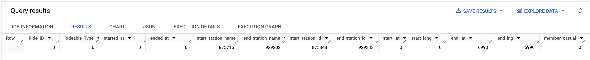
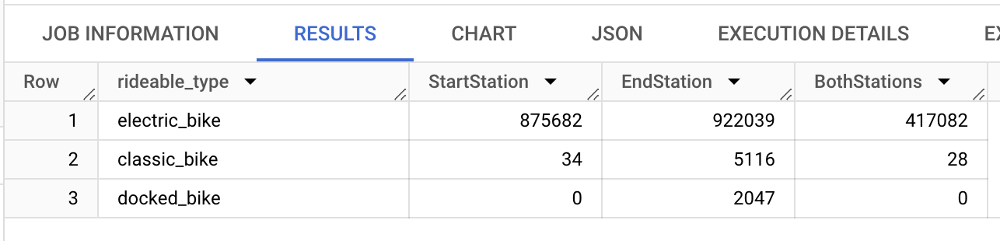
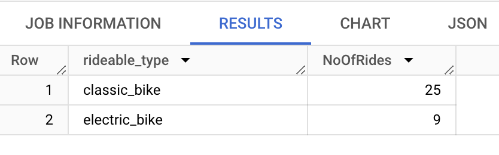
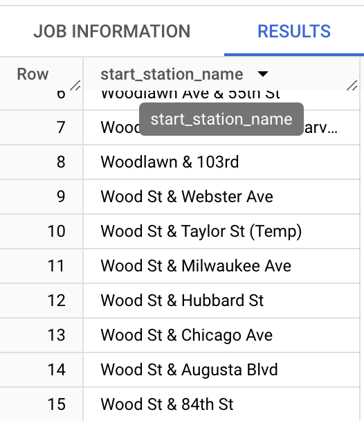
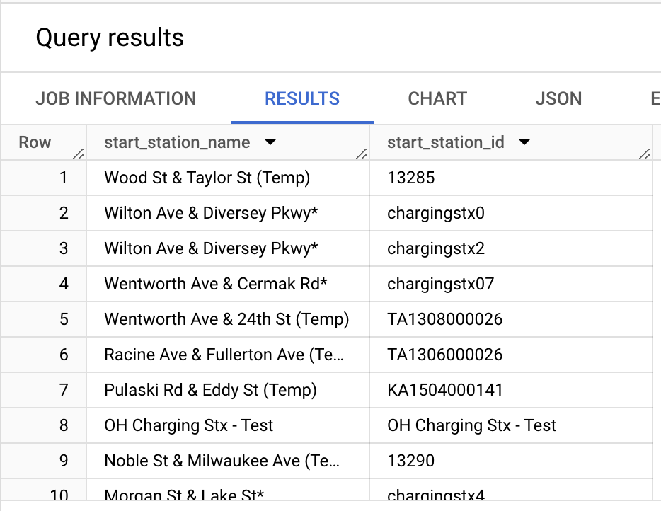

# Data Preparation

#### Loading data using BigQuery

**Project and Dataset Setup:**
I created a new BigQuery project named "Cyclistic" to house all relevant datasets and tables. Within the project, I created a dataset with the same name, "Cyclistic".

**Issues**
When attempting direct upload, I encountered BigQuery's 100MB file size limit for local uploads.
To circumvent this, I leveraged Google Cloud Storage:
* Created a new bucket named "Cyclistic" in Google Cloud Storage.
* Efficiently uploaded the unzipped CSV files to this bucket.

**Data Import from Cloud Storage:**
* In BigQuery, I selected the option to import data from Google Cloud Storage.
* I located and selected each CSV file from the "Cyclistic" bucket.
* During table creation, I enabled "Auto Schema Detection" for automatic column header identification.



Now I had all the files/tables successfully uploaded into the dataset for our next step which is Data Inspection.

After successfully loading the files, I performed the following checks:

- I inspected each table's schema and metadata, ensuring consistency in table names, data types, and overall structure across all uploaded tables.

- Noting that all columns are currently NULLABLE, I plan to run queries to identify specific columns with null values and determine the extent of missing data.

- Since no primary keys were assigned during the individual uploads, I have two options:  analyze the data to identify columns (or combinations of columns) that could potentially serve as primary keys or proceed without primary keys if the analysis doesn't reveal suitable candidates and my analysis goals don't strictly require them.


On inspecting the metadata one by one of each table I find that the number of rows are quite large so to save the time and make our queries efficient I will limit the query result to top few rows.


#### Combining Tables

Although analysis using individual tables and JOINS is possible, the consistent data structure across tables makes combining them into a single large table more efficient.  To achieve this, I created a new table named 'Yearly_Trips_2023' using the UNION ALL operation, resulting in the following query:

``` sql
CREATE TABLE `cyclistic-414307.Cyclistic_Dataset.Yearly_Trips_2023` AS

(Select * FROM `cyclistic-414307.Cyclistic_Dataset.Trip_2023_Jan`
UNION ALL
SELECT *
FROM `cyclistic-414307.Cyclistic_Dataset.Trip_2023_Feb`
UNION ALL
SELECT *
FROM `cyclistic-414307.Cyclistic_Dataset.Trip_2023_Mar`
UNION ALL
SELECT *
FROM `cyclistic-414307.Cyclistic_Dataset.Trip_2023_Apr`
UNION ALL
SELECT *
FROM `cyclistic-414307.Cyclistic_Dataset.Trip_2023_May`
UNION ALL
SELECT *
FROM `cyclistic-414307.Cyclistic_Dataset.Trip_2023_Jun`
UNION ALL
SELECT *
FROM `cyclistic-414307.Cyclistic_Dataset.Trip_2023_Jul`
UNION ALL
SELECT *
FROM `cyclistic-414307.Cyclistic_Dataset.Trip_2023_Aug`
UNION ALL
SELECT *
FROM `cyclistic-414307.Cyclistic_Dataset.Trip_2023_Sep`
UNION ALL
SELECT *
FROM `cyclistic-414307.Cyclistic_Dataset.Trip_2023_Oct`
UNION ALL
SELECT *
FROM `cyclistic-414307.Cyclistic_Dataset.Trip_2023_Nov`
UNION ALL
SELECT *
FROM `cyclistic-414307.Cyclistic_Dataset.Trip_2023_Dec`)
```

After successfully combining the tables, the resulting 'Yearly_Trips_2023' table contains a total of 5719877 rows. This substantial dataset highligts the choice of BigQuery SQL for this analysis, as its speed and efficiency are essential for effectively handling data of this scale.

#### Data Exploration

I now have all tables combined into one and ready for the next step which is Data inspection. 
I will start with checking/counting the **NULL Values** in all of the columns using **COUNTIF()**

``` sql
SELECT 
  COUNTIF(ride_id IS NULL) AS Ride_ID,
  COUNTIF(rideable_type IS NULL) AS Rideable_Type,
  COUNTIF (started_at IS NULL) AS started_at,
  COUNTIF (ended_at IS NULL) AS ended_at,
  COUNTIF(start_station_name IS NULL) AS start_station_name, 
  COUNTIF(end_station_name IS NULL) as end_station_name, 
  COUNTIF(start_station_id IS NULL) AS start_station_id,
  COUNTIF(end_station_id IS NULL) AS end_station_id,
  COUNTIF(start_lat IS NULL) AS start_lat,
  COUNTIF(start_lng IS NULL) AS start_lang,
  COUNTIF(end_lat IS NULL) AS end_lat,
  COUNTIF(end_lng IS NULL) AS end_lng,
  COUNTIF(member_casual IS NULL) AS member_casual
FROM `cyclistic-414307.Cyclistic_Dataset.Yearly_Trips_2023` 
LIMIT 20
```



What I found is that **Ride_ID, Rudeable_Type, Start_lat, Start_lang and Member_Casual** rows do not contain any NULL values however **Start_station_name, end_station_name, start_station_id, end_station_id, end_lat and end lang** contains large number of NULL values.


**Bikes with Missing Trip Durations (start date but no end date, or vice versa):**

**Potential Causes:**

- **Ongoing Trips:** The most likely reason; trips that were started but haven't finished at the time the data was extracted.
- **Data Errors:** Potential software or hardware glitches at docking stations, preventing proper recording of start or end times.
- **Abandoned Bikes:** Less common, but bikes may be left outside stations without being properly docked.
- **Theft:** A possibility, but likely a smaller proportion compared to other causes.

**Bikes Specifically with NULL start and end dates:**

- **Data Entry Errors:** The most likely culprit for completely missing records.
- **Bikes Under Maintenance:** Possible, but would typically be flagged differently in the dataset.
- **Retired Bikes:** May apply, but again, likely to be indicated differently.


``` sql
SELECT rideable_type, COUNTIF(start_station_name IS NULL) AS StartStation, COUNTIF(end_station_name IS NULL) AS EndStation, 
        COUNTIF(end_station_name IS NULL AND start_station_name IS NULL) AS BothStations, 
FROM `cyclistic-414307.Cyclistic_Dataset.Yearly_Trips_2023`
GROUP BY rideable_type
```




With insights on **NULL** values, my next step is to verify the integrity of the 'Started_at' and 'Ended_at' timestamps. Specifically, I'll use **TIMESTAMP_DIFF()** to identify and count any negative timestamps (where the end time precedes the start time), while also ensuring I exclude rows with **NULL** values in any column.


``` sql
SELECT rideable_type, COUNT(TIMESTAMP_DIFF(ended_at, started_at, MINUTE)) AS NoOfRides
FROM `cyclistic-414307.Cyclistic_Dataset.Yearly_Trips_2023`
WHERE TIMESTAMP_DIFF(ended_at, started_at, MINUTE) < 0
    AND start_station_name IS NOT NULL
    AND end_station_name IS NOT NULL
    AND start_station_id IS NOT NULL
    AND end_station_id IS NOT NULL
    AND end_lat IS NOT NULL
    AND end_lng IS NOT NULL
GROUP BY rideable_type
```



In the result I find that there are **34 Negative Values**

#### Inspecting Stations Names
Next i will check the distinct **start_station_name** to verify if there are any incorrect values in them.


``` sql
SELECT DISTINCT start_station_name
FROM `cyclistic-414307.Cyclistic_Dataset.Yearly_Trips_2023` 
ORDER BY start_station_name DESC
LIMIT 100;

SELECT DISTINCT start_station_name, start_station_id
FROM `cyclistic-414307.Cyclistic_Dataset.Yearly_Trips_2023`
WHERE start_station_name LIKE '%*%'
   OR start_station_name LIKE '%Temp%'
   OR start_station_name LIKE '%Test%'
ORDER BY start_station_name DESC
LIMIT 100;

```



**Results**: 
**Inconsistent Naming:** Some stations have temporary labels ("Temp") or testing markers ("Test", "*").
**Duplicate Names with Different IDs:** Stations share the same name (e.g., "Wentworth Ave & Cermak Rd") but possess different station_id values. This suggests they might be separate stations in close proximity.
**Station ID Issues:** Non-uniform IDs: Some station_id values are numeric, while others are alphanumeric.


