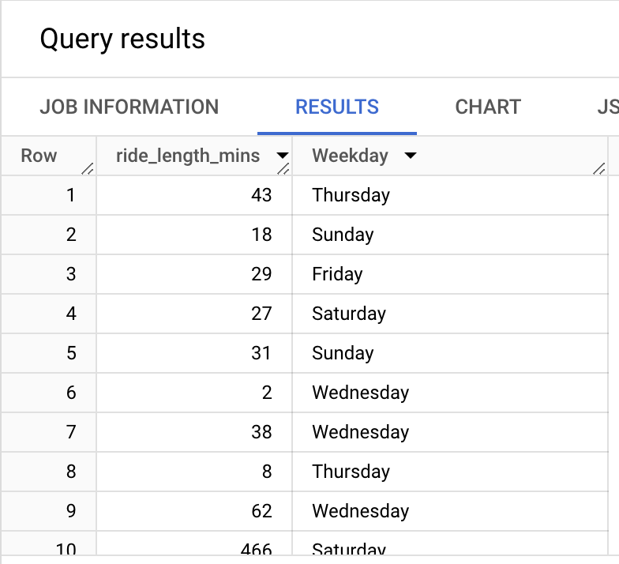

# Processing Data


Creating 2 columns calculate **ride_length_mins** and **Weekday**.

1. **ride_length_mins** will be the difference in time between **start_time** and **end_time** in minutes. I will use **TIMESTAMP_DIFF()** for calculation.
2. For **Weekday** I will use **FORMAT_DATE()** to know the day of the week.

``` sql
Alter TABLE 
  `cyclistic-414307.Cyclistic_Dataset.Yearly_Trips_2023`
  ADD COLUMN ride_length_mins NUMERIC,
  ADD COLUMN Weekday STRING;

# Performing the calculations and populating the columns
UPDATE `cyclistic-414307.Cyclistic_Dataset.Yearly_Trips_2023`
SET
  ride_length_mins = TIMESTAMP_DIFF(ended_at, started_at, MINUTE),
  Weekday = FORMAT_DATE('%A', DATE(started_at))
  WHERE TRUE;

```



Now I have 2 more columns successfully added to the table for additional analysis.

### Cleaning table & inporting data in Tableau

Creating a new Table **Cleaned_Yearly_Trips_2023** to copy all the NON NULL values into the table for accurate analysis.
NULL Values are the missing values, creating analysis on missing values can result in erroneous analysis. 

``` sql
CREATE TABLE `cyclistic-414307.Cyclistic_Dataset.Cleaned_Yearly_Trips_2023` AS 
SELECT *
FROM `cyclistic-414307.Cyclistic_Dataset.Yearly_Trips_2023`
WHERE ride_id IS NOT NULL 
AND rideable_type IS NOT NULL
AND started_at IS NOT NULL
AND ended_at IS NOT NULL
AND start_station_name IS NOT NULL
AND end_station_name IS NOT NULL
AND start_station_id IS NOT NULL
AND end_station_id IS NOT NULL
AND start_lat IS NOT NULL
AND start_lng IS NOT NULL
AND end_lat IS NOT NULL
AND end_lng IS NOT NULL
AND member_casual IS NOT NULL
AND ride_length_mins IS NOT NULL
AND Weekday IS NOT NULL
;
```

Now as the data cleaned next I have exported data using **Google Colab** as a Txt file which I will be importing into the Tableau to **vizualize** the data.
Further I will be using BigQuery along with Tableau to validate the data and visualize it side by side.