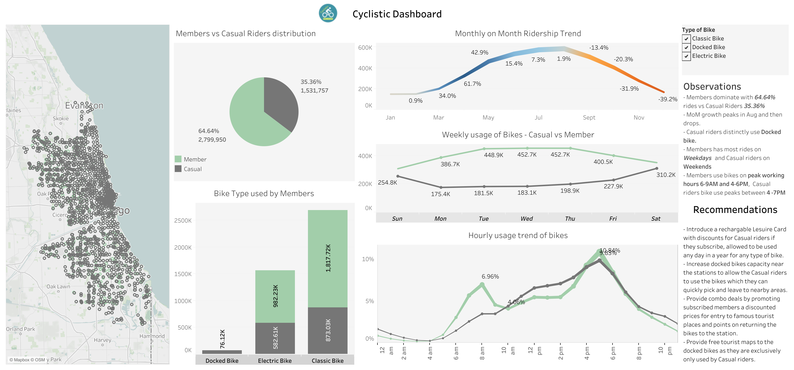

# Analyzing Cleaned Data

#### Data Overview

[Click here to see the Dashboard](https://public.tableau.com/views/Cyclistic_2_17105871770820/Cyclistic_Overall?:language=en-GB&publish=yes&:sid=&:display_count=n&:origin=viz_share_link)



##### Members vs. Casual Riders proportion in percentage

``` sql
SELECT 
  member_casual, 
  ROUND((COUNT(ride_id)*100/(SELECT COUNT(*) FROM `cyclistic-414307.Cyclistic_Dataset.Cleaned_Yearly_Trips_2023`)),2) AS Percentage
FROM `cyclistic-414307.Cyclistic_Dataset.Cleaned_Yearly_Trips_2023`
GROUP BY member_casual
```


- First I'll check **distinct** bikes Cyclistic has and the **percentage** of each type of bike out of total. 

``` sql
SELECT rideable_type, COUNT(rideable_type) AS Total_Count,
ROUND((COUNT(rideable_type) *100/(SELECT COUNT(*) FROM `cyclistic-414307.Cyclistic_Dataset.Cleaned_Yearly_Trips_2023`)),1) AS Percentage
FROM `cyclistic-414307.Cyclistic_Dataset.Cleaned_Yearly_Trips_2023`
GROUP BY rideable_type;
```


#### **Calculations**
Calculate the mean of ride_length, the max ride_length, mode of day_of_week

``` sql
# One to calculate the MeanRideLength and MaxRideLength
# Another to calculate the Mode
# Create a CTE to combine 2 queries results into one. 

WITH ride_stats AS (
  SELECT ROUND(AVG(ride_length_mins), 2) AS MeanRideLength, #Calculating AVG/Mean and Max
         MAX(ride_length_mins) AS MaxRideLength,
  FROM `cyclistic-414307.Cyclistic_Dataset.Cleaned_Yearly_Trips_2023`
  ),

  # Calculating the Mode and limiting the result to only top 1 result

  weekday_stats AS (
  SELECT Weekday AS Mode, COUNT(*) AS frequency
  FROM `cyclistic-414307.Cyclistic_Dataset.Cleaned_Yearly_Trips_2023`
  GROUP BY Weekday 
  ORDER BY frequency DESC
  LIMIT 1
)

SELECT ride_stats.*, weekday_stats.Mode
FROM ride_stats, weekday_stats; 

```


Classic_bike are the one which are mosty used bikes compared to other bikes.

### Date and Time Trends

##### a. Hourly Trend

To understand which are the most busiest hours I will extract the hours from started_at colum and then group it by members along with number of rides and percentage for sorting. 

``` sql
# Extract the Hours using EXTRACT()
# Calculate Average Ride Count each Hour
# Percentage of the total

SELECT
  member_casual,
  EXTRACT(HOUR FROM started_at) AS Hourly_Time,
  COUNT(ride_id) AS Rides,
  ROUND((COUNT(ride_id)*100/(SELECT COUNT(*) FROM `cyclistic-414307.Cyclistic_Dataset.Cleaned_Yearly_Trips_2023`)),2) AS Percentage
FROM `cyclistic-414307.Cyclistic_Dataset.Cleaned_Yearly_Trips_2023`
GROUP BY member_casual, Hourly_Time
ORDER BY member_casual DESC, Rides DESC
```


**b. Day of the week trend**


``` sql
# Format the weekday names in characters eg: Sunday, Monday
# Coun the rides
# Calculate the percentage
# Sort the data based on Percentage in Descending order to see which Weekday is the highest in Rides.

SELECT 
  member_casual,
  FORMAT_DATETIME("%A", started_at) AS Weekday, -- Use FORMAT_DATETIME for BigQuery
  COUNT(ride_id) AS Rides,
  ROUND((COUNT(ride_id)*100/(SELECT COUNT(*) FROM `cyclistic-414307.Cyclistic_Dataset.Cleaned_Yearly_Trips_2023`)),2) AS Percentage
FROM `cyclistic-414307.Cyclistic_Dataset.Cleaned_Yearly_Trips_2023`
GROUP BY member_casual, Weekday 
ORDER BY member_casual DESC, Rides DESC 

```


##### **c. Monthly Trend**

``` sql
SELECT 
  member_casual,
  FORMAT_DATETIME("%B", started_at) AS Month, -- Extract the month 
  COUNT(ride_id) AS Rides,
  ROUND((COUNT(ride_id)*100/(SELECT COUNT(*) FROM `cyclistic-414307.Cyclistic_Dataset.Cleaned_Yearly_Trips_2023`)),2) AS Percentage
FROM `cyclistic-414307.Cyclistic_Dataset.Cleaned_Yearly_Trips_2023`
GROUP BY member_casual, Month  --  Month in GROUP BY
ORDER BY member_casual DESC, Rides DESC -- Include Month in ORDER BY
```


