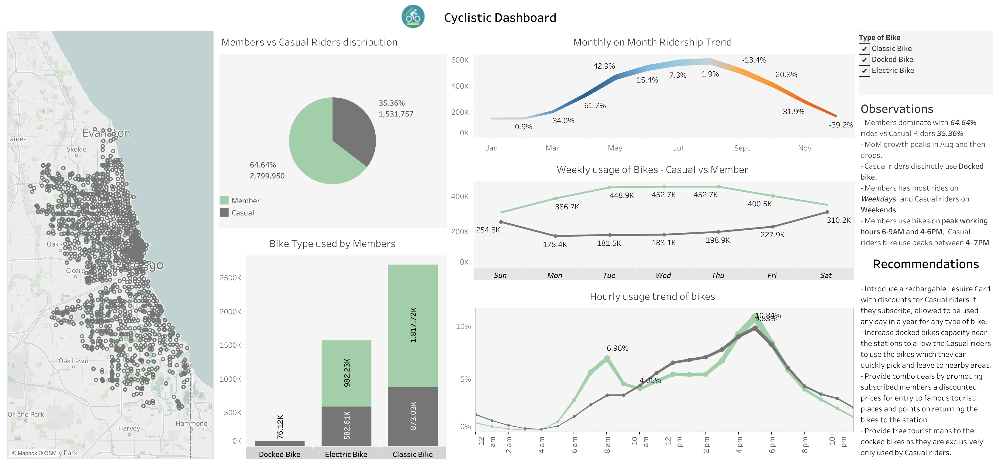

### Recommendations:

[Dashboard Link](https://public.tableau.com/views/Cyclistic_2_17105871770820/Cyclistic_Overall?:language=en-GB&:sid=&:display_count=n&:origin=viz_share_link)

**Data-Driven Strategies to Boost Casual Rider Conversion**

Our analysis of the Cyclistic ridership data has revealed insights and opportunities to convert casual riders into loyal, subscribed members.  Key findings and recommendations include:

* **Significant Casual Rider Base:** The pie chart represents that 35% of Casual riders represents a large potential market for new subscriptions.  
* **Targeted Membership Matters:** A new "Leisure Card" subscription, designed specifically for casual riders, could increase uptake. Key features:
    * Flexible use any day of the year
    * Tiered pricing based on expected usage patterns
    * Weekend-focused promotions (as we saw in Weekday trends)
* **Incentivize Behavior:** A point system that rewards proper docking will improve bike availability and operational efficiency, enhancing rider experience. Consider a gamification element to make this engaging.
* **Partnerships are Key:** Combo deals with local attractions, especially those popular with casual riders (parks, museums, etc.), would add value. Reciprocal promotion with businesses near stations increases visibility.
* **Enhance User Experience:** Clear navigation aids (maps, signage) guiding riders to nearby attractions will make the bikes even more appealing for casual use.

**Marketing Focus**

* **Targeted Campaign:** Develop a campaign promoting the "Leisure Card," highlighting its convenience, value, and the unique experiences it unlocks for casual riders. 
* **Digital and Physical Channels:** Employ targeted digital advertising (social, location-based) along with physical signage near popular casual-use stations.

**Next Steps**

* **Refine Subscription Model:**  Finalize pricing tiers for the Leisure Card based on deeper usage pattern analysis.
* **Develop Points System:** Design the rewards structure and explore potential gamification elements.
* **Identify Partnership Opportunities:**  Research businesses and attractions that align with likely casual rider demographics and interests.

## Conclusion
- Implementing the above recommendations Cyclistic can attract Casual riders to become subscribers.
- There can be more opportunities which can be uncovered by analysis data further in detail eg: Exploring bike preference, Areas that have higher rides etc.
- Excluded data which has NULL values can be inspected to verify and solve several issues.